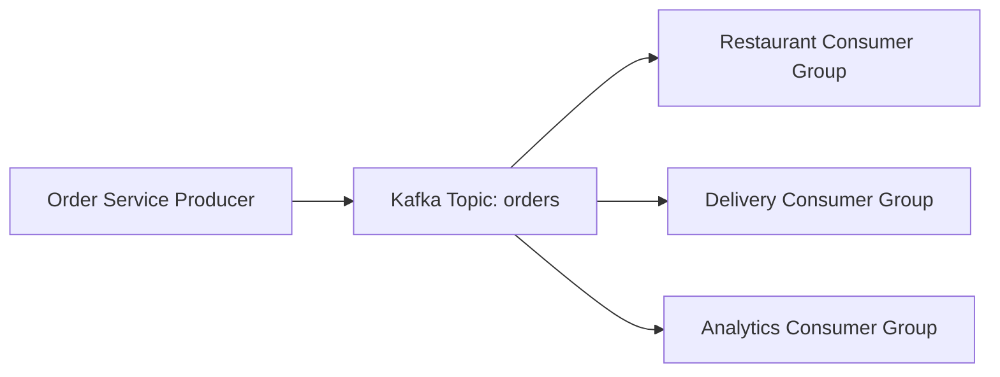

# Kafka Zero to Hero

Beginner-friendly Kafka tutorial content with runnable examples and Docker-based local setup.

## What is Kafka?

Kafka is a distributed event streaming platform. In simple words, it is a system that lets one part of your application publish events and other parts consume those events in real time.

### Simple real-time scenario

Think about a food delivery app:

- A customer places an order.
- The restaurant dashboard needs that order immediately.
- The delivery partner app needs updates when the order is ready.
- The analytics team wants to count orders by city.

Instead of every service calling every other service directly, the order service can publish an event like `order_created` to Kafka. Every interested system can read that event independently.

That makes Kafka a central event highway for your data.

## Why Kafka?

Kafka is useful when many systems need the same information at the same time, but for different reasons.

### Same real-time scenario

In the food delivery example, one order event can be used by:

- the restaurant service to start preparing food
- the delivery system to plan pickup
- the notification service to send updates to the customer
- the analytics service to build dashboards

Without Kafka, the order service would need direct integrations with every consumer. That creates tight coupling.

With Kafka:

- producers and consumers stay decoupled
- multiple consumers can read the same event
- messages are stored for replay
- the platform can scale as traffic grows

## Kafka Building Blocks

### Producer

The application that sends data to Kafka.

Example: an order service publishing `order_created` events.

### Topic

A named stream of events.

Example: `orders`, `payments`, `notifications`.

### Partition

Each topic is split into partitions. Partitions allow Kafka to scale and process events in parallel.

Important rule: ordering is guaranteed only inside a single partition.

### Broker

A Kafka server. A Kafka cluster is made of one or more brokers.

### Consumer

An application that reads messages from Kafka.

Example: a notification service reading from the `orders` topic.

### Consumer Group

Multiple consumer instances can share work under one group id.

- same group: messages are divided across consumers
- different groups: each group gets its own copy of the topic data

### Offset

Every message in a partition has an offset. Kafka uses offsets to track which messages were already read.

## Visual Model



## Kafka Setup

### Prerequisites

- Docker Desktop
- Python 3.11 or later

### 1. Create a virtual environment

```bash
python3 -m venv .venv
source .venv/bin/activate
pip install --upgrade pip
pip install -e .
```

### 2. Start Kafka

```bash
./scripts/start-kafka.sh
```

This starts a single-node Kafka broker on `localhost:9092` using KRaft mode.

Kafka UI is also started and available in the browser at `http://localhost:8080`.

### 3. Stop Kafka

```bash
./scripts/stop-kafka.sh
```

## Live Terminal Demo (Recommended For Presentations)

This flow matches how you would explain Kafka in real time:

1. Start Kafka.
2. Start producer and show events being written.
3. Start consumer and show near real-time reads.

### Terminal 1: Start Kafka

```bash
./scripts/start-kafka.sh
```

Optional browser view:

- Kafka UI: `http://localhost:8080`

### Terminal 2: Create topic once

```bash
source .venv/bin/activate
python examples/live_topic_setup.py --topic order-events-live
```

### Terminal 3: Start producer

```bash
source .venv/bin/activate
python examples/live_producer.py --topic order-events-live --interval 1
```

You will see `PRODUCED_EVENT ...` logs continuously.

### Terminal 4: Start consumer

```bash
source .venv/bin/activate
python examples/live_consumer.py --topic order-events-live
```

You will see `CONSUMED_EVENT ...` logs almost immediately after each produced event.

Useful options:

- Read old events too: `python examples/live_consumer.py --topic order-events-live --from-beginning`
- Produce a fixed number of events: `python examples/live_producer.py --topic order-events-live --max-events 20`

### What it demonstrates

- creating a topic
- publishing JSON events continuously
- consuming those events continuously
- seeing near real-time flow from producer to consumer

## Challenges with Kafka

Kafka is powerful, but it introduces real engineering challenges.

### 1. Ordering is not global

Ordering is guaranteed only within a partition, not across the whole topic.

### 2. Duplicate processing can happen

Consumers may process a message more than once, so applications should be idempotent.

### 3. Schema changes need discipline

If event structure changes carelessly, consumers can break.

### 4. Operations become more complex

You need monitoring, alerting, topic planning, retention settings, and capacity planning.

### 5. It can be overkill

For a very small application with simple request-response communication, Kafka may add unnecessary complexity.

## Repo Structure

```text
.
├── README.md
├── compose.yaml
├── examples
│   ├── live_consumer.py
│   ├── live_producer.py
│   └── live_topic_setup.py
├── scripts
│   ├── start-kafka.sh
│   └── stop-kafka.sh
├── src
│   └── kafka_zero_to_hero
│       ├── __init__.py
│       └── common.py
```

